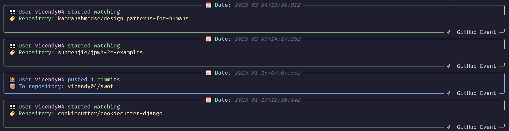

# GitHub User Activity CLI 🎉

Want to know what your favorite GitHub user is up to? Just one command away! 🚀

## Features:

- Get the latest activity of a GitHub user.

- Easy to use. Just type `github-activity <username>`.

## How to use:

1. Clone the repo and install the deps! 🖥️
```bash
pip install -r requirements.txt
```

2. Run `github-activity <username>` (replace `<username>` with the GitHub username you want to check).

3. Done! View their recent activity instantly. 🔄

## Example



## Todo:

- [ ] Support more types.
